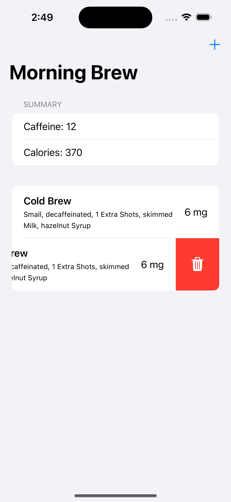
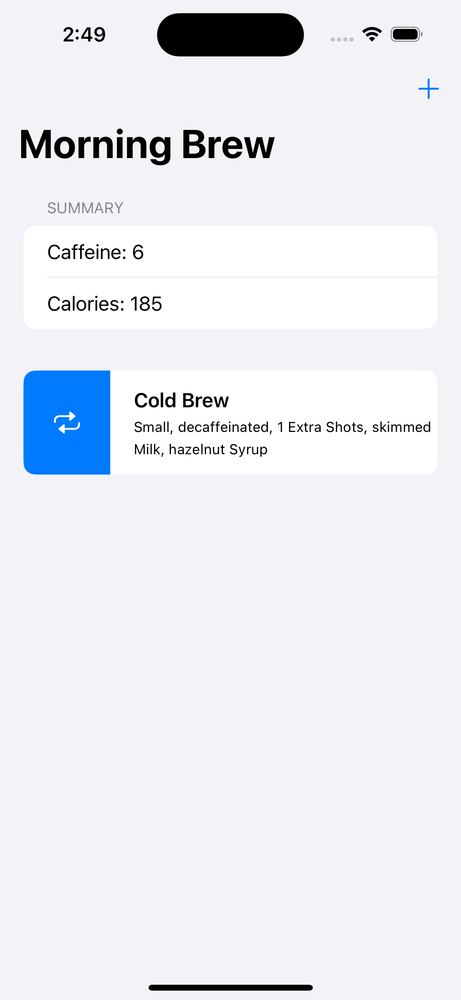
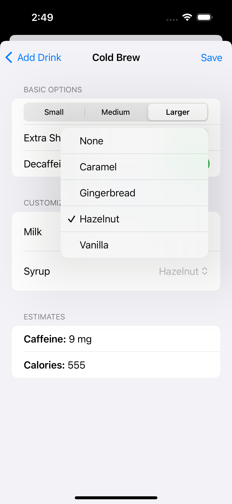
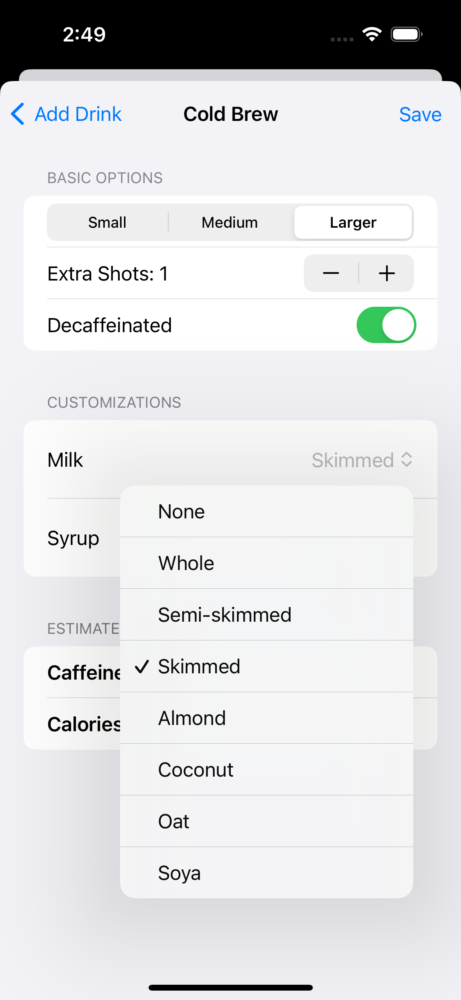
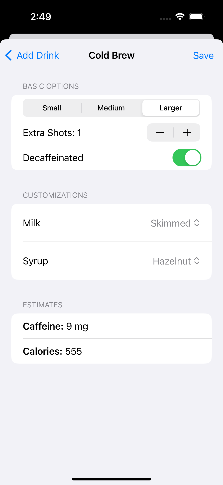
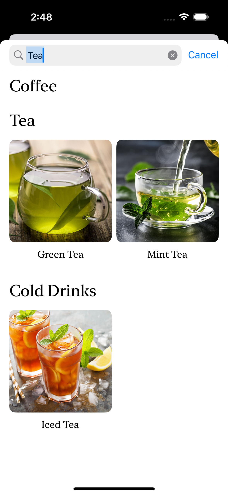
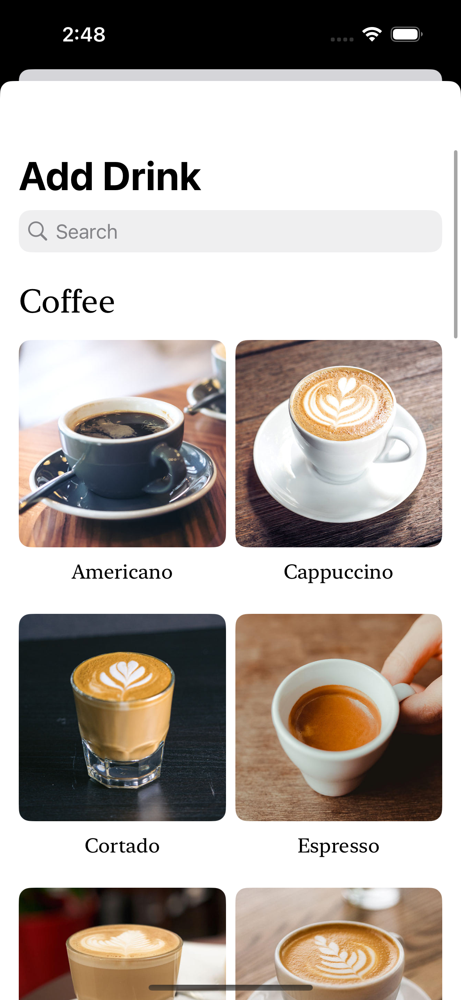

# Morning Brew

Morning Brew is a mobile application that provides users with detailed nutritional information for various coffee and tea beverages, including caffeine content and calorie counts. The app is built using Swift and SwiftUI.

## Screenshots

<div style="display: flex; flex-wrap: wrap; justify-content: space-around;">
    
    
    
    
    
    
    
</div>

## Features
- Detailed nutritional information for beverages
- User-friendly interface
- Search functionality

## Installation

1. Clone the repository:
    ```sh
    git clone https://github.com/Sarthak309/Morning_Brew.git
    ```

2. Open the project in Xcode:
    ```sh
    cd Morning_Brew
    open Morning_Brew.xcodeproj
    ```

3. Install dependencies using CocoaPods (if applicable):
    ```sh
    pod install
    ```

4. Build and run the app on your simulator or device.

## Usage

1. Open the app on your iOS device.
2. Browse through the list of beverages.
3. Select a beverage to view its nutritional information.

## Technologies Used
- Swift
- SwiftUI
